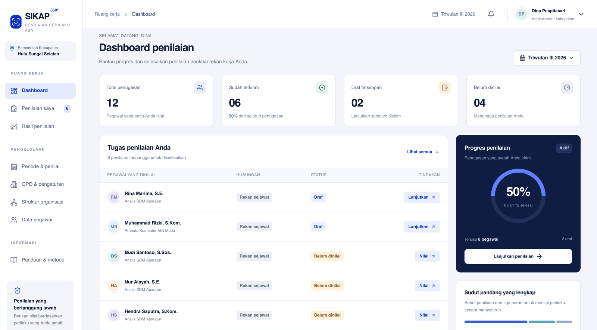

# SIKAP 360



[](https://github.com/Syamsuddin/sikap-360/releases)
[](LICENSE)
[](https://www.php.net/)
[](https://www.mysql.com/)
[](https://tailwindcss.com/)
[](https://daisyui.com/)
[](compose.yaml)
[](tests/)
[](CHANGELOG.md)

Aplikasi penilaian perilaku ASN berbasis PHP 8.3, MySQL, Tailwind CSS 4, dan daisyUI 5. Tampilan dan alur mengikuti 12 gambar referensi. Data contoh memakai identitas fiktif, tanpa foto, email, atau NIP orang pada gambar.

## Isi aplikasi

Satu instalasi melayani satu kabupaten (nama dinamis, bawaan Hulu Sungai Selatan) dengan banyak OPD dalam satu kerangka. Administrator kabupaten mengelola OPD, periode, dan pengaturan; Admin OPD mengelola pegawai, struktur organisasi, dan pasangan penilai OPD-nya; periode penilaian berlaku serentak untuk seluruh OPD.

- Login lokal dan dua hak akses: administrator dan ASN.
- Dashboard tugas, progres, profil, dan batas periode.
- Pencarian dan penyaringan tugas menurut hubungan serta status.
- Tujuh indikator BerAKHLAK dengan skala bilangan bulat 1–5.
- Draf parsial, validasi tujuh jawaban, pengiriman satu atau beberapa draf lengkap.
- Penguncian jawaban setelah dikirim, nomor versi draf untuk mencegah penimpaan antar sesi.
- Hasil pribadi gabungan, grafik indikator, pilihan periode, dan cetak melalui browser.
- Penambahan/edit pegawai, akun ASN, perubahan kata sandi, ekspor CSV.
- Pembuatan periode, distribusi penilai, buka/tutup/buka kembali, dan publikasi.
- Audit tindakan di database, CSRF, sesi HttpOnly, PDO prepared statements, pembatasan percobaan login.

## Dua bentuk penggunaan

`public/` adalah aplikasi PHP yang terhubung ke MySQL melalui `public/api.php`. Semua penilaian disimpan di database. Aplikasi tidak beralih ke data demo jika koneksi gagal.

`dist/` adalah pratinjau statis dengan data fiktif dan penyimpanan lokal browser. Berlabel Ruang demo. Tombol Coba sebagai admin membuka simulasi pengelolaan. Pratinjau ini tidak menjalankan backend PHP, tidak memakai MySQL, dan tidak menjadi penyimpanan bersama antarpegawai. Reset melalui menu profil.

## Instalasi cepat dengan Docker

Kebutuhan: Docker Engine dan Docker Compose.

1. Salin `.env.example` menjadi `.env`.
2. Ganti `DB_PASSWORD` dan `MYSQL_ROOT_PASSWORD`. Pertahankan `APP_URL="http://localhost:8080"` untuk uji lokal. Di produksi HTTPS, set `SESSION_SECURE="1"` dan isi `TRUSTED_PROXIES` dengan IP reverse proxy agar pembatasan login mengenali IP klien, bukan IP proxy.
3. Jalankan:

```bash
docker compose up -d --build
docker compose exec app php scripts/install.php --demo
```

Buka http://localhost:8080.

Akun demo (masuk dengan email, atau NIP `DEMO-0001` dan seterusnya):

| Akses | Email | Kata sandi |
| --- | --- | --- |
| Administrator | pegawai1@example.test | SikapDemo2026! |
| ASN | pegawai3@example.test | SikapDemo2026! |

Seeder membuat kabupaten Hulu Sungai Selatan dengan lima OPD (Sekretariat Daerah, BKPSDM, Dinas Pendidikan dan Kebudayaan, Dinas Komunikasi dan Informatika, Dinas Kesehatan; 60 pegawai), struktur organisasi tiap OPD, dua periode triwulan, dan distribusi penilai yang diturunkan dari struktur. pegawai1 (Disdikbud) dan pegawai28 (BKPSDM) adalah administrator kabupaten; tiap OPD punya satu Admin OPD (lihat USERS.md). Periode aktif adalah triwulan berjalan saat instalasi; triwulan sebelumnya berstatus dipublikasikan. Administrator juga memiliki tugas sebagai ASN. Skor periode terdahulu telah dipublikasikan untuk mencoba halaman hasil.

Untuk database kosong tanpa contoh, gunakan instalasi berikut. Tetapkan nilai pada lingkungan shell Anda, jangan menuliskan kata sandi pada source code atau Git.

```bash
export ADMIN_EMAIL='admin@instansi.go.id'
export ADMIN_NAME='Nama Administrator'
export ADMIN_NIP='ISI_NIP_18_DIGIT'
export KABUPATEN_NAME='Hulu Sungai Selatan'   # opsional, bawaan Hulu Sungai Selatan; bisa diubah lagi di menu OPD & pengaturan
export ADMIN_OPD='Sekretariat Daerah'         # opsional, OPD tempat akun admin didaftarkan
read -rs -p 'Kata sandi admin: ' ADMIN_PASSWORD
export ADMIN_PASSWORD
docker compose exec -e ADMIN_EMAIL -e ADMIN_NAME -e ADMIN_NIP -e ADMIN_PASSWORD -e KABUPATEN_NAME -e ADMIN_OPD app php scripts/install.php
unset ADMIN_PASSWORD
```

Instalasi menolak menimpa database yang sudah memiliki akun. Pilih instalasi demo atau instalasi kosong pada database yang berbeda. Jangan gunakan akun demo dalam produksi.

## Instalasi PHP biasa, Ubuntu, XAMPP, atau MAMP

Kebutuhan: PHP 8.3+ dengan ekstensi `pdo_mysql`, `mbstring`, `session`, `json`, dan MySQL 8.0.16+ atau 8.4. Node.js hanya diperlukan ketika mengubah CSS. CSS hasil kompilasi sudah disertakan.

1. Buat database `sikap360` dengan charset `utf8mb4` dan akun database khusus aplikasi.
2. Salin `.env.example` menjadi `.env` lalu isi host, port, nama database, pengguna, kata sandi, dan `APP_URL`.
3. Jalankan `php scripts/install.php --demo`, atau siapkan environment admin dan jalankan tanpa `--demo`.
4. Arahkan document root Apache/Nginx ke folder `public/`, bukan akar proyek.
5. Untuk uji lokal:

```bash
php -S localhost:8080 -t public
```

Jika dipasang dalam subfolder, sesuaikan `APP_URL` dengan URL lengkap. Referensi aset dan API relatif terhadap halaman aplikasi.

Contoh konfigurasi Nginx tersedia pada `config/nginx.conf.example`. Sesuaikan socket PHP-FPM yang terpasang. Konfigurasi contoh memakai port HTTP untuk pemasangan awal. Untuk penggunaan instansi, aktifkan HTTPS, tetapkan `APP_URL` ke URL HTTPS yang benar, dan `SESSION_SECURE="1"`. Akses langsung database dan file `.env` dibatasi pada administrator server. Backup MySQL diperlukan sebelum perubahan lingkungan atau pembaruan aplikasi.

## Impor pegawai dari SIASN

`scripts/import-siasn.py` mengisi OPD, pegawai, akun, dan atasan langsung dari ekspor SIASN (`.xlsx`). Skrip ini **mengosongkan seluruh data** (kecuali indikator dan pengaturan) lalu mengisinya ulang, jadi backup database terlebih dahulu. Kebutuhan: Python 3 dengan `pandas`, `openpyxl`, `pymysql`, serta PHP CLI. Koneksi database dibaca dari `.env`.

```bash
python3 scripts/import-siasn.py ekspor-siasn.xlsx          # pratinjau statistik tanpa menulis
python3 scripts/import-siasn.py ekspor-siasn.xlsx --apply --admin email.admin@instansi.go.id
```

- OPD diturunkan dari pohon UNOR; nomenklatur lama/baru digabung, Kelurahan masuk Kecamatan, UPT dan RSUD Daha Sejahtera masuk dinas induknya.
- Atasan langsung adalah pejabat struktural unit pegawai, atau unit induknya bila jabatan itu kosong.
- Guru, pegawai sekolah (SD/SMP/TK), dan Puskesmas tidak diimpor kecuali dengan `--semua`, karena kepala sekolah dan kepala Puskesmas tidak tercatat di SIASN.
- Pegawai tanpa UNOR masuk OPD "Unit Organisasi Belum Terpetakan". Email yang kosong, rusak, atau dipakai bersama diganti `NIP@sikap360.local`.
- Pegawai masuk dengan NIP (18 digit) atau email SIASN-nya; kata sandi awal adalah NIP dan dapat diganti pada menu Profil. Impor ditolak bila sudah ada penugasan penilaian, kecuali dengan `--timpa-penilaian`.
- Hanya kolom yang dipakai aplikasi yang diimpor; NIK, alamat, HP, dan NPWP diabaikan. Jangan simpan berkas ekspor SIASN di repositori.

## Urutan pengoperasian

1. Masuk sebagai administrator kabupaten. Pada menu OPD & pengaturan, periksa nama kabupaten (bawaan Hulu Sungai Selatan) dan daftarkan OPD. Lengkapi data pegawai; tetapkan peran Admin OPD bagi pengelola tiap OPD agar mereka mengurus pegawai, struktur, dan pasangan penilai OPD-nya sendiri.
2. Tetapkan atasan langsung setiap pegawai pada menu Struktur organisasi (atau pada formulir pegawai). Rekan sejawat dan bawahan langsung diturunkan otomatis. Rekan pejabat (pegawai yang punya bawahan) adalah sesama pejabat dengan atasan yang sama, misalnya Sekretaris dan para Kepala Bidang di bawah Kepala Badan; rekan staf adalah staf lain dalam unit (UNOR) yang sama, dan laman ini memperlihatkan apakah komposisi penilai tiap pegawai sudah sah. Agar kepala OPD ikut dinilai, administrator kabupaten dapat mendaftarkan Bupati (OPD tingkat kabupaten, NIP diisi kode seperti `BUPATI-HSS`) dan menetapkannya sebagai atasan para kepala OPD; para kepala OPD lalu saling menjadi rekan sejawat.
3. Buat periode berstatus draf dengan memilih tahun dan triwulan (I: Januari–Maret, II: April–Juni, III: Juli–September, IV: Oktober–Desember), kemudian pilih periode tersebut. Nama dan rentang tanggal ditetapkan otomatis; satu triwulan hanya bisa dibuat sekali.
4. Tekan Buat penugasan pada Struktur organisasi untuk mengisi pasangan penilai dari struktur, atau tambahkan penilai satu per satu pada Periode & penilai. Kelompok rekan/bawahan yang kurang dari tiga orang dilewati dan dilaporkan.
5. Pilih peran berdasarkan posisi penilai terhadap pegawai yang dinilai. Jika A menilai bawahannya B, peran penilai A adalah Atasan. Di daftar tugas A, B diberi label Bawahan.
6. Buka periode setelah komposisi lengkap. Distribusi penilai dikunci sejak periode dibuka.
7. ASN mengisi tujuh indikator. Draf disimpan di server dan tetap tersedia setelah login kembali.
8. Kirim draf lengkap. Jawaban yang terkirim tidak bisa diedit.
9. Setelah semua penugasan selesai, tutup periode dan publikasikan hasil.
10. Jika periode ditutup terlalu cepat, admin membuka kembali periode yang belum dipublikasikan. Pengisian mengikuti status periode, bukan rentang tanggal: selama periode dibuka, ASN tetap dapat menyimpan dan mengirim penilaian.
11. ASN memilih periode yang dipublikasikan pada Hasil penilaian.

Pegawai yang belum diberi pasangan penilai belum menjadi peserta penilaian pada periode tersebut. Penilaian diri sendiri ditolak. Pasangan penilai yang sama tidak bisa didaftarkan dua kali untuk pegawai/periode yang sama.

## Perhitungan

Bobot bawaan mengikuti gambar pengguna, bukan klaim bobot universal yang diwajibkan regulasi. Bobot melekat pada tiap periode. Administrator kabupaten dapat mengubah bobot periode berstatus draf pada laman Metode (bilangan bulat 1–99, jumlah tiap kondisi 100%); sejak periode dibuka, bobotnya terkunci sehingga aturan tidak berubah selama penilaian berjalan maupun setelah nilai terlihat. Periode baru menyalin bobot periode terbaru.

| Komposisi | Atasan | Rekan sejawat | Bawahan |
| --- | ---: | ---: | ---: |
| Tiga peran | 60% | 25% | 15% |
| Atasan dan rekan | 75% | 25% | 0% |
| Atasan dan bawahan | 85% | 0% | 15% |

Setiap pegawai memiliki tepat satu penilai atasan. Kelompok rekan dan bawahan yang digunakan masing-masing minimal tiga penilai. Komposisi di luar ketiga kondisi ditolak ketika periode dibuka. Aturan minimum tiga merupakan keputusan desain untuk mengurangi kemudahan menebak penilai, bukan angka yang disalin dari gambar.

Untuk setiap indikator:

1. Hitung rata-rata skor dalam masing-masing kelompok penilai.
2. Kalikan rata-rata kelompok dengan bobotnya, lalu jumlahkan.
3. Kalikan nilai tertimbang dengan 20 untuk konversi skala 20–100.

Nilai akhir adalah rata-rata tujuh indikator sebelum pembulatan. Tampilan dibulatkan dua desimal. Contoh: seluruh indikator atasan 5, rekan 4, bawahan 3 menghasilkan `(5×0,60 + 4×0,25 + 3×0,15) × 20 = 89`.

Jumlah orang dalam kelompok tidak mengubah bobot kelompok. Penilaian yang belum masuk tidak diisi nol dan tidak memicu pengalihan bobot. Publikasi diblokir sampai seluruh penugasan pada periode telah terkirim dengan tujuh jawaban valid.

Skor adalah hasil kuantitatif rubrik. Aplikasi tidak menetapkan predikat resmi kinerja, keputusan kepegawaian, atau kelayakan manajemen talenta secara otomatis.

## Kerahasiaan dan batas implementasi

- Akun ASN menerima tugas miliknya dan hasil gabungan dirinya sendiri.
- Identitas penilai masuk dan nilai individualnya tidak dikirim ke halaman hasil pribadi.
- Administrator mengakses pegawai, pasangan penilai, dan status pengiriman. API ini tidak menyediakan pembacaan catatan/nilai individual orang lain untuk administrator.
- Relasi penilai dan jawaban tetap disimpan di database untuk kebutuhan integritas dan audit. Administrator database mempunyai akses teknis. Sistem tidak menjanjikan anonimitas terhadap pengelola server.
- Catatan pengembangan disimpan tetapi belum dipublikasikan kepada pegawai. Tinjauan/anonimisasi catatan belum dibuat.
- Login memakai akun lokal. SIMPEG, SSO, SKP/eKinerja, notifikasi email/WhatsApp, dan manajemen talenta belum diintegrasikan.
- Unit kerja berupa nama unit. Cakupan admin saat ini seluruh aplikasi, belum ada administrator dengan pembatasan per OPD.
- Data audit tersedia di tabel `audit_logs`, belum ada halaman penampil audit.
- Instrumen tujuh indikator tetap untuk versi 1.0. Penggantian indikator setelah ada data memerlukan versi instrumen/migrasi, bukan pengeditan langsung. Bobot komposisi dapat diubah administrator kabupaten per periode selama draf dan terkunci sejak periode dibuka.

## Struktur proyek

| Lokasi | Fungsi |
| --- | --- |
| public/index.php | Halaman utama PHP |
| public/api.php | Endpoint JSON dan pengamanan HTTP |
| public/assets/app.js | Antarmuka bersama PHP dan pratinjau |
| resources/demo.js | Adapter pratinjau lokal, disalin ke dist/ saat build dan hanya dipanggil dalam mode demo |
| public/assets/app.css | CSS Tailwind/daisyUI hasil kompilasi |
| public/assets/theme.js | Pemasang tema terang/gelap sebelum halaman digambar |
| app/Api.php | Autentikasi, akses, dan operasi transaksi |
| app/Scoring.php | Validasi komposisi, jawaban, dan perhitungan |
| app/Database.php | Koneksi PDO MySQL |
| database/schema.sql | Struktur database dan tujuh indikator |
| database/upgrade-1.1-struktur.sql | Migrasi kolom supervisor_id untuk instalasi yang dibuat sebelum fitur struktur organisasi |
| database/upgrade-1.2-opd.sql | Migrasi multi-OPD (tabel opd, settings, employees.opd_id, peran admin_opd); tiap nilai unit lama menjadi satu OPD |
| database/upgrade-1.8-bobot.sql | Kolom periods.weights: bobot komposisi tiap periode (diubah di laman Metode selama draf) |
| config/app.php | Pembacaan konfigurasi lingkungan |
| scripts/install.php | Instalasi awal melalui CLI |
| scripts/seed-demo.php | Seeder data fiktif |
| scripts/import-siasn.py | Impor OPD, pegawai, akun, dan atasan langsung dari ekspor SIASN |
| resources/app.css | Sumber tema dan stylesheet |
| dist/ | Pratinjau statis |
| tests/scoring.php | Pengujian aturan penilaian |
| docs/VALIDASI.md | Hasil verifikasi dan langkah uji server |

## Mengubah tampilan

```bash
npm ci
npm run build
```

Perintah membangun CSS lokal dan menyalin antarmuka ke `dist/`. Produksi tidak membutuhkan CDN. Sumber dan versi pasti dependency tercatat dalam `package-lock.json`. Dependensi tampilan memakai [instalasi resmi daisyUI](https://daisyui.com/docs/install/) dan [Tailwind CLI](https://tailwindcss.com/docs/installation/tailwind-cli). Ikon berasal dari Lucide. Lisensi dependensi disertakan pada `THIRD_PARTY_NOTICES.md`.

Warna di `resources/app.css` ditulis sebagai `var(--ui-token, #warna-terang)`. Token `--ui-*` hanya didefinisikan pada blok tema gelap (`:root[data-theme=dark]`), sehingga tema terang memakai nilai cadangan. Warna baru mengikuti pola yang sama: pakai token yang sudah ada, atau tambahkan token beserta nilai gelapnya pada blok tersebut.

## Pengujian perhitungan

```bash
php tests/scoring.php
```

Pengujian meliputi tiga rumus bobot, draf, jawaban tidak lengkap, skala, kelompok kecil, komposisi tidak didukung, dan jumlah penilai dalam kelompok.
